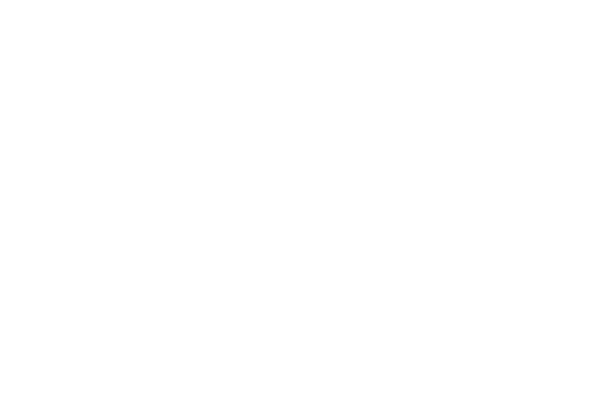
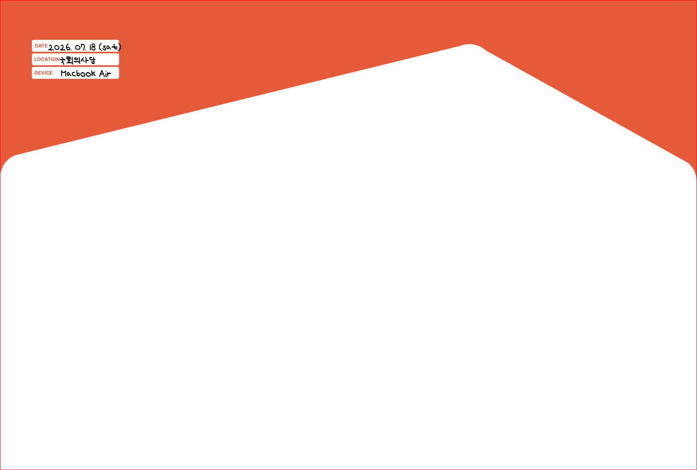
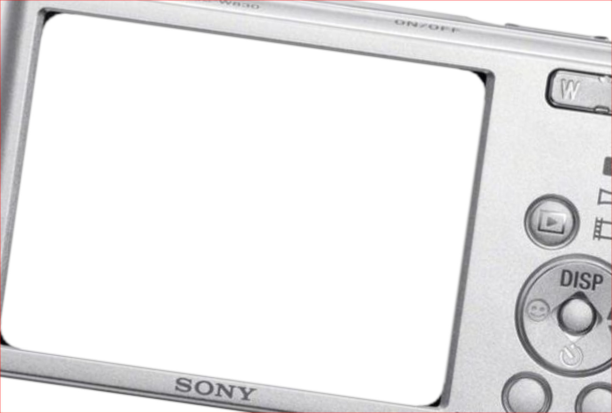

# ZIPZIP Photo Booth

Mac 카메라로 사진을 촬영하고 ZIPZIP 전용 프레임을 적용해 인쇄하거나 JPEG로 저장하는 macOS 포토부스 앱입니다.

## 프레임 미리보기

앱에서 선택할 수 있는 프레임은 다음 4종입니다. 촬영 전·후 언제든 `필터` 버튼을 눌러 다른 프레임으로 변경할 수 있습니다.

<table>
  <tr>
    <th width="25%">오렌지 로고</th>
    <th width="25%">화이트 로고</th>
    <th width="25%">하우스</th>
    <th width="25%">디지털 카메라</th>
  </tr>
  <tr>
    <td bgcolor="#666666"></td>
    <td bgcolor="#666666"></td>
    <td bgcolor="#666666"></td>
    <td bgcolor="#666666"></td>
  </tr>
</table>

## 주요 기능

- 카메라 실시간 미리보기
- 미리보기 화면과 동일한 밝기·구도의 프레임 촬영
- 촬영 화면과 인쇄 결과 좌우 반전
- ZIPZIP 전용 프레임 4종 선택 및 촬영 후 변경
- 100×148mm 용지 비율의 가로 사진 인쇄
- 선택한 프레임이 합성된 JPEG 파일 저장
- 촬영과 재촬영을 위한 키보드 단축키

## 키보드 단축키

| 키 | 동작 |
|---|---|
| `Space` | 사진 촬영 |
| `R` | 촬영 결과를 지우고 재촬영 화면으로 이동 |
| `Esc` | 필터 선택 창 닫기 |

단축키는 한글 입력 상태에서도 물리 키를 기준으로 동작합니다.

## 실행 환경

- macOS 14 이상
- Apple Silicon Mac
- 내장 카메라 또는 macOS에서 인식되는 외장 카메라
- Xcode 또는 Xcode Command Line Tools

Command Line Tools가 설치되어 있지 않다면 다음 명령으로 설치할 수 있습니다.

```bash
xcode-select --install
```

## 빌드 및 실행

이 프로젝트는 별도의 Xcode 프로젝트 없이 Swift 컴파일러와 빌드 스크립트로 앱 번들을 생성합니다.

```bash
git clone https://github.com/zipzip-team/zipzip-photobooth.git
cd zipzip-photobooth
./Scripts/build_app.sh
open .build/PhotoPrintBooth.app
```

빌드 결과는 `.build/PhotoPrintBooth.app`에 생성됩니다. 처음 실행하면 macOS 카메라 접근 권한 안내가 표시됩니다.

## 촬영 흐름

1. 앱을 실행하고 카메라 권한을 허용합니다.
2. `필터` 버튼을 눌러 사용할 프레임을 선택합니다.
3. 화면의 촬영 버튼 또는 `Space` 키로 사진을 촬영합니다.
4. 필요한 경우 다른 프레임을 선택하거나 `다시` 버튼 또는 `R` 키로 재촬영합니다.
5. `Save`로 JPEG 파일을 저장하거나 `Print`로 인쇄합니다.

## 인쇄 및 저장 규격

| 항목 | 값 |
|---|---|
| 용지 크기 | 148×100mm 가로 방향 |
| 화면 및 출력 비율 | 148:100 |
| 300dpi 기준 권장 크기 | 1748×1181px |
| 저장 형식 | JPEG |
| JPEG 품질 | 95% |

인쇄 시 macOS 인쇄 패널이 열리며, 앱은 용지 크기와 여백을 148×100mm 가로 출력에 맞게 설정합니다.

## 프레임 리소스 추가

프레임은 투명 배경의 PNG 또는 SVG 파일로 준비합니다.

- 권장 크기: 1748×1181px
- 권장 색상 프로필: sRGB
- 저장 위치: `Resources/Filters/`
- 사진이 표시될 부분은 투명하게 유지

새 프레임을 추가할 때는 `Sources/Filters.swift`의 `BoothFilter`에 이름과 리소스 파일을 등록해야 합니다.

## 프로젝트 구조

```text
zipzip-photobooth/
├── Sources/
│   ├── PhotoPrintBoothApp.swift  # 앱 진입점
│   ├── ContentView.swift         # 화면 구성과 사용자 입력
│   ├── CameraModel.swift         # 카메라 세션과 촬영
│   ├── CameraPreview.swift       # 실시간 카메라 미리보기
│   ├── Filters.swift             # 프레임과 이미지 처리
│   └── PrintRenderer.swift       # 인쇄와 JPEG 저장
├── Resources/
│   ├── Filters/                  # 프레임 이미지
│   ├── Info.plist                # 앱 설정과 카메라 권한 문구
│   └── AppIcon.icns              # 앱 아이콘
└── Scripts/
    └── build_app.sh              # macOS 앱 빌드 스크립트
```

## 기술 구성

- SwiftUI
- AppKit
- AVFoundation
- Core Image
- Core Graphics
